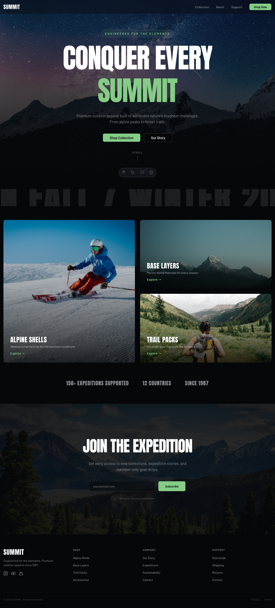
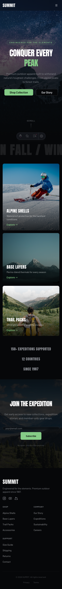

# Vibecoder Heaven: Шаблон лендинга

Современный шаблон лендинга, оптимизированный для **разработки с помощью ИИ**. Клонируйте, откройте Claude Code, опишите что хотите — получите готовый к продакшену лендинг.

Построен на [Astro](https://astro.build/) + [React](https://react.dev/) + [shadcn/ui](https://ui.shadcn.com/) (Base UI) + [Tailwind CSS v4](https://tailwindcss.com/). Генерирует статический HTML. Деплоится через Docker + nginx + Traefik.

| Десктоп | Мобильная версия |
|---------|-----------------|
|  |  |

## Быстрый старт

```bash
# Клонируйте шаблон
git clone https://github.com/agalitsyn/vibecoder-heaven-langing-page.git my-landing
cd my-landing

# Установите зависимости
pnpm install

# Откройте Claude Code и начните создавать
claude
```

Затем скажите Claude что вам нужно:

> «Создай лендинг для SaaS-продукта Acme, который помогает разработчикам деплоить быстрее. Используй тёмную тему, добавь hero с градиентным фоном, сетку фич из 4 элементов, прайсинг с 2 тарифами и форму подписки на рассылку.»

Claude имеет доступ к документации shadcn/ui и Astro через MCP-серверы (предварительно настроены в `.mcp.json`), поэтому он может просматривать доступные компоненты, устанавливать новые и автоматически следовать лучшим практикам фреймворков.

## Технологический стек

| Уровень | Инструмент | Зачем |
|---------|-----------|-------|
| Фреймворк | [Astro 5](https://astro.build/) | Генератор статических сайтов — ноль JS по умолчанию, молниеносная загрузка |
| UI-библиотека | [React 19](https://react.dev/) | Для интерактивных компонентов (островов) |
| Компоненты | [shadcn/ui](https://ui.shadcn.com/) | Копируемые компоненты, которые вы полностью контролируете |
| Примитивы | [Base UI](https://base-ui.com/) | Headless-примитивы от создателей Radix + MUI |
| Стили | [Tailwind CSS v4](https://tailwindcss.com/) | CSS-first конфигурация, блоки `@theme` в CSS |
| Иконки | [Lucide React](https://lucide.dev/) | Красивый, консистентный набор иконок |
| Раздача | nginx (alpine) | Легковесный сервер статических файлов |
| Маршрутизация | [Traefik v3](https://traefik.io/) | Обратный прокси с авто-TLS через Let's Encrypt |

## Структура проекта

```
src/
├── components/
│   ├── ui/                  # Компоненты shadcn/ui (примитивы Base UI)
│   │   ├── button.tsx
│   │   ├── card.tsx
│   │   ├── badge.tsx
│   │   ├── separator.tsx
│   │   └── sheet.tsx
│   └── landing/             # Секции лендинга
│       ├── Navbar.astro     # Фиксированная навигация + мобильное меню
│       ├── MobileNav.tsx    # Интерактивное мобильное меню (React-остров)
│       ├── Hero.astro       # Заголовок, CTA-кнопки, опциональное изображение
│       ├── Features.astro   # Сетка фич с карточками
│       ├── Pricing.astro    # Карточки тарифов с выделением
│       ├── Testimonials.astro
│       ├── CTA.astro        # Баннер с призывом к действию
│       └── Footer.astro     # Многоколоночный футер
├── layouts/
│   └── BaseLayout.astro     # HTML head, мета-теги, глобальные стили
├── lib/
│   └── utils.ts             # Утилита cn() для Tailwind-классов
├── styles/
│   └── global.css           # Импорты Tailwind + переменные темы
└── pages/
    └── index.astro          # Лендинг (компоновка из секций)
```

## Как это работает

Секции лендинга — это **Astro-компоненты** (файлы `.astro`), которые принимают пропсы для контента. Внутри они используют React-компоненты shadcn/ui, но компилируются в **чистый статический HTML** на этапе сборки — JavaScript не отправляется в браузер.

Единственное исключение — `MobileNav.tsx`, который использует `client:visible` для гидратации Sheet (выдвижного меню) на мобильных устройствах.

Чтобы собрать страницу, скомпонуйте секции в `src/pages/index.astro`:

```astro
---
import BaseLayout from '../layouts/BaseLayout.astro';
import Navbar from '../components/landing/Navbar.astro';
import Hero from '../components/landing/Hero.astro';
import Features from '../components/landing/Features.astro';
import Footer from '../components/landing/Footer.astro';
---
<BaseLayout title="My Product">
  <Navbar logo="Acme" />
  <Hero
    headline="Деплойте быстрее с Acme"
    subtext="Платформа деплоя для современных команд."
    primaryCTA={{ label: "Начать бесплатно", href: "/signup" }}
  />
  <Features features={[
    { icon: "🚀", title: "Быстрый деплой", description: "Push для деплоя за секунды." },
    { icon: "🔒", title: "Безопасно", description: "SOC 2 из коробки." },
  ]} />
  <Footer />
</BaseLayout>
```

## Доступные секции

Каждая секция опциональна и компонуема. Передавайте разные пропсы для настройки контента:

| Секция | Пропсы |
|--------|--------|
| `Navbar` | `logo`, `links[]`, `cta` |
| `Hero` | `headline`, `subtext`, `primaryCTA`, `secondaryCTA`, `image` |
| `Features` | `headline`, `subtext`, `features[]` (icon, title, description) |
| `Pricing` | `headline`, `subtext`, `tiers[]` (name, price, features, cta, highlighted) |
| `Testimonials` | `headline`, `subtext`, `testimonials[]` (quote, author, role, avatar) |
| `CTA` | `headline`, `subtext`, `primaryCTA`, `secondaryCTA` |
| `Footer` | `logo`, `columns[]` (title, links), `copyright` |

## Добавление новых компонентов shadcn/ui

Установите любой компонент из реестра shadcn/ui:

```bash
pnpm dlx shadcn@latest add dialog
pnpm dlx shadcn@latest add accordion tabs input textarea
```

Все компоненты автоматически используют примитивы **Base UI** (настроено через `"style": "base-vega"` в `components.json`).

## Настройка темы

### Вариант 1: Редактирование CSS-переменных напрямую

Все переменные темы находятся в `src/styles/global.css`. Меняйте цвета, радиусы, шрифты:

```css
:root {
    --radius: 0.625rem;
    --primary: oklch(0.205 0 0);
    --primary-foreground: oklch(0.985 0 0);
    /* ... */
}
```

### Вариант 2: Использование tweakcn (визуальный редактор)

[tweakcn.com](https://tweakcn.com/) — интерактивный редактор тем для shadcn/ui. Он позволяет:

- Визуально настраивать цвета, типографику, радиусы скругления, тени
- Просматривать изменения на реальных компонентах shadcn/ui в реальном времени
- Экспортировать сгенерированные CSS-переменные

**Рабочий процесс:**

1. Откройте [tweakcn.com](https://tweakcn.com/)
2. Настройте цвета, шрифты, радиусы, тени по вкусу
3. Скопируйте сгенерированные CSS-переменные
4. Вставьте в `src/styles/global.css`, заменив блоки `:root` и `.dark`

Это самый быстрый способ создать уникальный визуальный стиль без ручной настройки значений oklch.

### Вариант 3: Смена базового стиля

shadcn/ui с Base UI поддерживает несколько визуальных стилей. Отредактируйте `components.json`:

```json
{
  "style": "base-vega"
}
```

Доступные стили Base UI: `base-vega`, `base-nova`, `base-maia`, `base-lyra`, `base-mira`. После смены стиля переустановите компоненты:

```bash
pnpm dlx shadcn@latest add --all --overwrite
```

## MCP-серверы

Проект включает предварительно настроенные серверы [MCP (Model Context Protocol)](https://modelcontextprotocol.io/) в `.mcp.json`, которые дают ИИ-ассистентам прямой доступ к документации фреймворков и реестрам компонентов.

### shadcn/ui MCP

```json
{
  "shadcn": {
    "command": "npx",
    "args": ["shadcn@latest", "mcp"]
  }
}
```

[Официальный MCP-сервер shadcn](https://ui.shadcn.com/docs/mcp) даёт вашему ИИ-ассистенту возможность:

- **Просматривать компоненты** — список всех доступных компонентов, блоков и шаблонов из реестра shadcn/ui
- **Искать** — находить компоненты по имени или функциональности
- **Устанавливать** — добавлять компоненты на естественном языке (например, «добавь форму логина»)

Когда вы просите Claude добавить новую секцию или компонент, он использует этот MCP для поиска нужного компонента shadcn/ui и его корректной установки.

### Astro Docs MCP

```json
{
  "astro-docs": {
    "type": "http",
    "url": "https://mcp.docs.astro.build/mcp"
  }
}
```

[Официальный MCP-сервер Astro Docs](https://docs.astro.build/en/guides/build-with-ai/) обеспечивает доступ к актуальной документации Astro в реальном времени. Это гарантирует, что Claude следует текущим лучшим практикам для:

- Маршрутизации страниц и лейаутов
- Островов компонентов и директив `client:*`
- Настройки генерации статического сайта
- Интеграций (React, Tailwind, MDX)

### Добавление дополнительных MCP-серверов

Отредактируйте `.mcp.json` для добавления серверов. Некоторые полезные:

```json
{
  "mcpServers": {
    "context7": {
      "command": "npx",
      "args": ["-y", "@upstash/context7-mcp"]
    }
  }
}
```

[Context7](https://context7.com/) предоставляет актуальную документацию для любой библиотеки (React, Tailwind и др.).

## Разработка

```bash
# Запуск dev-сервера
pnpm dev

# Сборка статического сайта
pnpm build

# Предпросмотр продакшен-сборки
pnpm preview
```

## Деплой через Docker

### Локальная сборка и запуск

```bash
docker build -t my-landing .
docker run --rm -p 8080:80 my-landing
```

Откройте `http://localhost:8080`.

### Деплой с Traefik (продакшен)

Включённый `docker-compose.yml` настраивает Traefik как обратный прокси с автоматическим HTTPS:

1. Отредактируйте `docker-compose.yml` — замените `you@example.com` на ваш email и `example.com` на ваш домен
2. Задеплойте:

```bash
docker-compose up -d
```

Traefik автоматически получает и обновляет TLS-сертификаты Let's Encrypt.

### Несколько лендингов

Для деплоя нескольких лендингов на одном сервере добавьте сервисы в `docker-compose.yml`:

```yaml
services:
  # ... конфигурация traefik ...

  landing-product-a:
    image: ghcr.io/you/landing-product-a:latest
    labels:
      - "traefik.enable=true"
      - "traefik.http.routers.product-a.rule=Host(`product-a.example.com`)"
      - "traefik.http.routers.product-a.entrypoints=websecure"
      - "traefik.http.routers.product-a.tls.certresolver=letsencrypt"

  landing-product-b:
    image: ghcr.io/you/landing-product-b:latest
    labels:
      - "traefik.enable=true"
      - "traefik.http.routers.product-b.rule=Host(`product-b.example.com`)"
      - "traefik.http.routers.product-b.entrypoints=websecure"
      - "traefik.http.routers.product-b.tls.certresolver=letsencrypt"
```

Каждый лендинг получает свой домен, свой Docker-образ и автоматический TLS. Traefik обнаруживает сервисы через Docker-метки.

## Создание нового лендинга

1. Клонируйте этот шаблон в новый репозиторий
2. Откройте Claude Code: `claude`
3. Опишите ваш лендинг на естественном языке
4. Claude настроит секции, тему и контент
5. `pnpm build` для генерации статических файлов
6. `docker build` и деплой

## Лицензия

MIT
